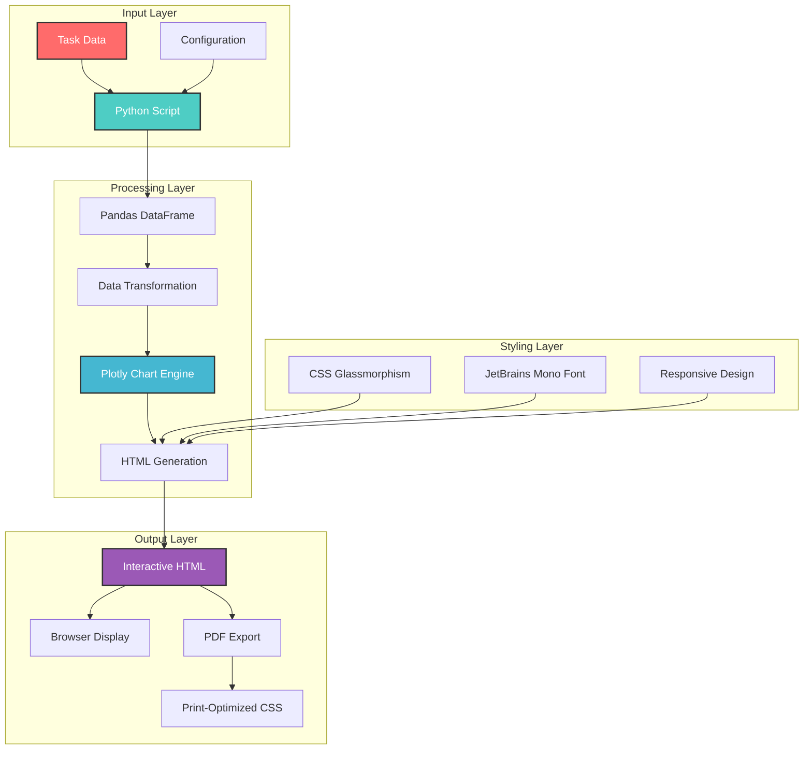
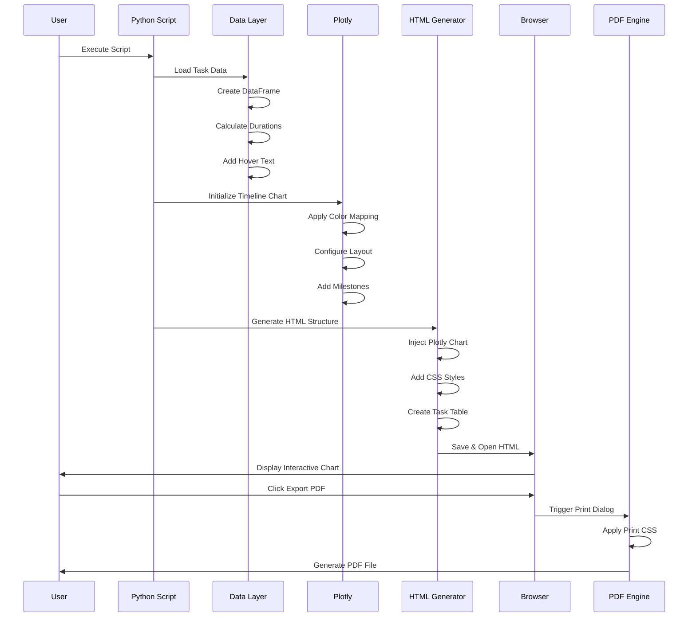
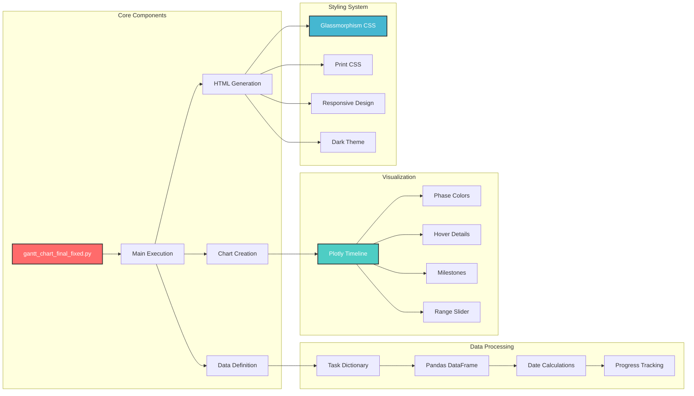
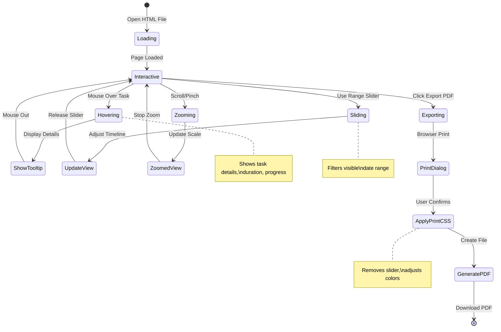
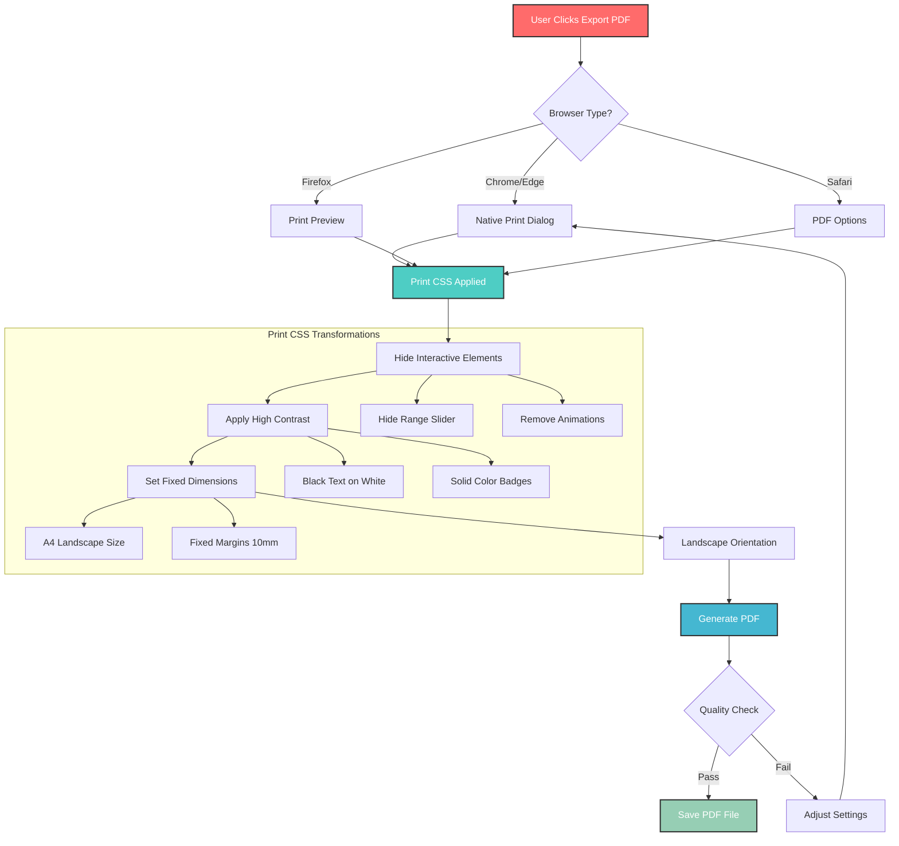
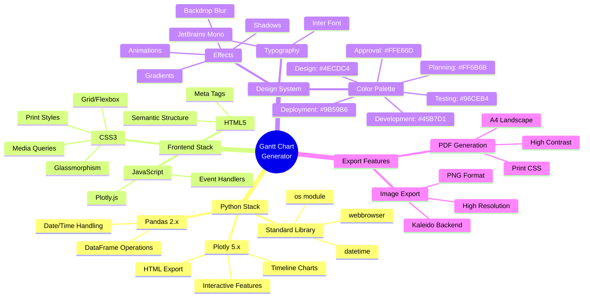
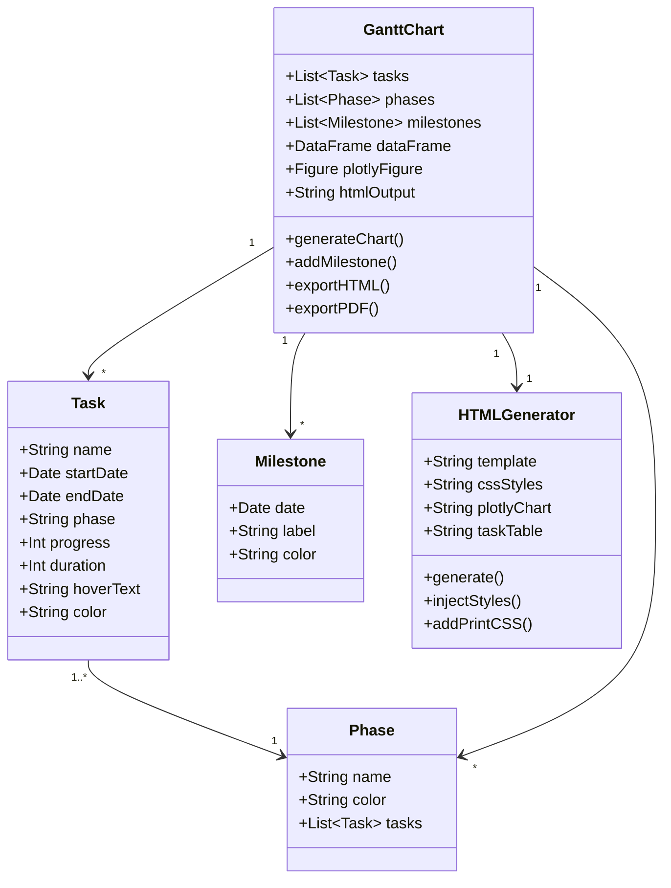
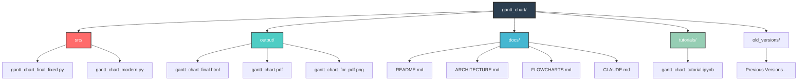
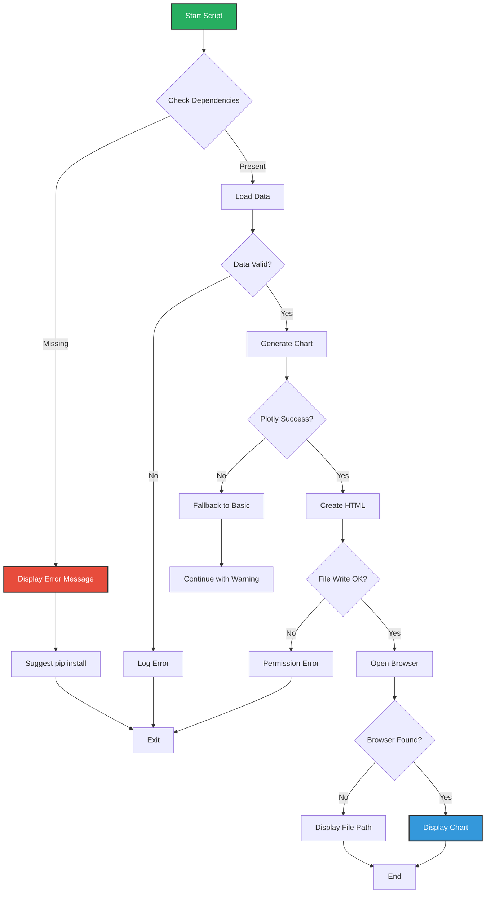
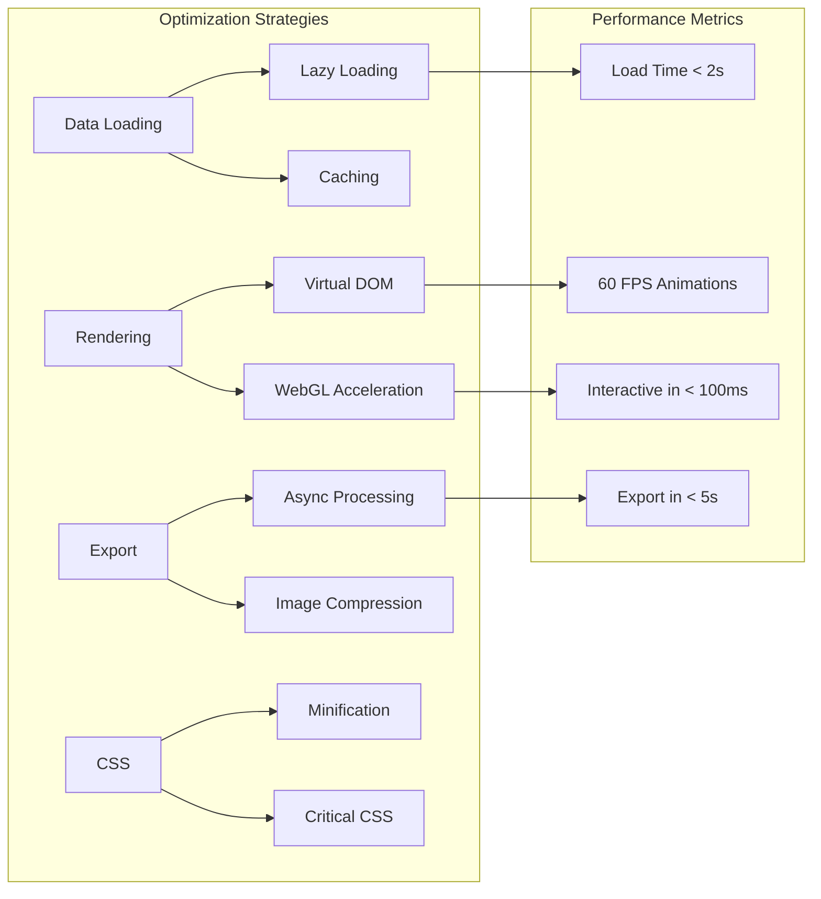

# Gantt Chart Generator - System Architecture & Flow Diagrams

## Table of Contents
1. [System Overview](#system-overview)
2. [Data Flow Architecture](#data-flow-architecture)
3. [Component Architecture](#component-architecture)
4. [User Interaction Flow](#user-interaction-flow)
5. [PDF Export Process](#pdf-export-process)
6. [Technical Stack](#technical-stack)

## System Overview

## Data Flow Architecture

## Component Architecture

## User Interaction Flow

## PDF Export Process

## Technical Stack

## Data Model

## File Structure

## Error Handling Flow

## Performance Optimization

---

## Usage Instructions

These diagrams can be rendered using any Mermaid-compatible viewer:
- GitHub (automatic rendering in markdown)
- VS Code with Mermaid extension
- Online editors like mermaid.live
- Documentation tools like MkDocs or Docusaurus

For best results, view these diagrams in a tool that supports Mermaid's latest features including mindmaps and state diagrams.